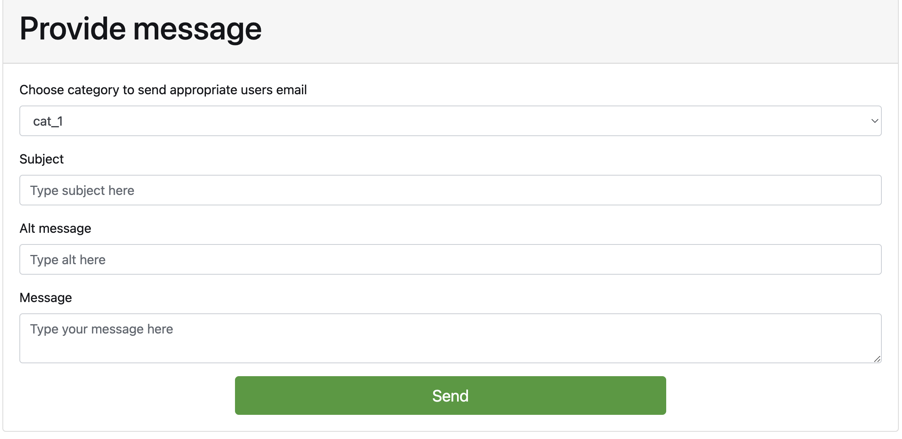

# EasyMail
This documentation outlines the functionality and implementation details of a PHP program designed to send emails with MySQL integration. The program involves three tables in the database: `users`, `categories`, and `users_categories`.

## Installation
1. Clone this repo: `https://github.com/GabrielaGodek/EasyMail.git`.
2. Open XAMPP and run `Apache Web Server` and `MySQL Database`. 
3. Open an type in the browser `localhost/phpmyadmin`.
4. Upload `easymail.sql` from src/db folder.
5. Open `http://localhost/path_to/EasyMail/index.php` at your browser.

## Usage
1. Select category from dropdown menu.
2. Input the subject, alt message and message.
3. Click "Send" to dispatch the message to users associated with the selected category.

### Additional information
1. For `cat_1` there are two suitable users.
2. For `cat_2` and `cat_3` there is only one.

## CRUD Operations
All functions can be found in `/src/db/query.php`

### get users by category
```php
function getUsersByCategory($cat)
{
    global $conn;

    $cat = intval($cat);

    $categoryQuery = "SELECT user_id FROM `user_categories` WHERE category_id=$cat";
    $categoryResult = mysqli_query($conn, $categoryQuery);

    if (!$categoryResult) {
        die("Error fetching users by category: " . mysqli_error($conn));
    }

    $userIDs = mysqli_fetch_all($categoryResult, MYSQLI_ASSOC);

    if (empty($userIDs)) {
        return [];
    }

    $userIDs = array_column($userIDs, 'user_id');

    // Get user details for the retrieved user IDs
    $sanitizedIds = implode(',', array_map('intval', $userIDs));
    $userQuery = empty($sanitizedIds) ? "SELECT * FROM `users`" : "SELECT * FROM `users` WHERE user_id IN ($sanitizedIds)";
    $userResult = mysqli_query($conn, $userQuery);

    if (!$userResult) {
        die("Error fetching users: " . mysqli_error($conn));
    }

    return mysqli_fetch_all($userResult, MYSQLI_ASSOC);
}
```

### Get all users
```php
function getAllUsers()
{
    global $conn;

    $sql = "SELECT * FROM `users`";
    $result = mysqli_query($conn, $sql);

    if ($result) {
        return mysqli_fetch_all($result, MYSQLI_ASSOC);
    } else {
        die("Error fetching users: " . mysqli_error($conn));
    }
}
```

### Get all categories
```php
function getCategories()
{
    global $conn;

    $sql = "SELECT * FROM `categories`";
    $result = mysqli_query($conn, $sql);

    if ($result) {
        return mysqli_fetch_all($result, MYSQLI_ASSOC);
    } else {
        die("Error fetching users: " . mysqli_error($conn));
    }
}
```

## Preview

